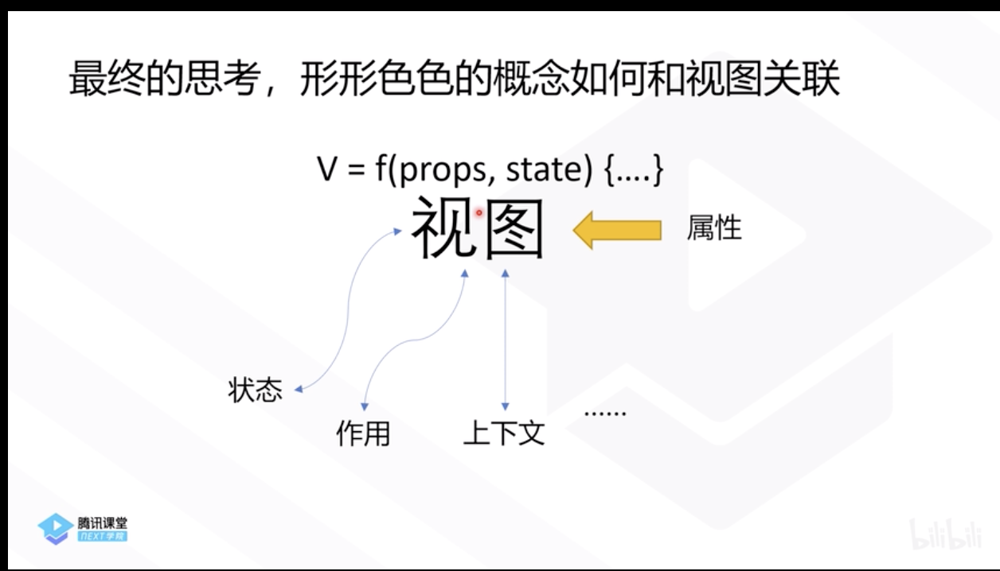
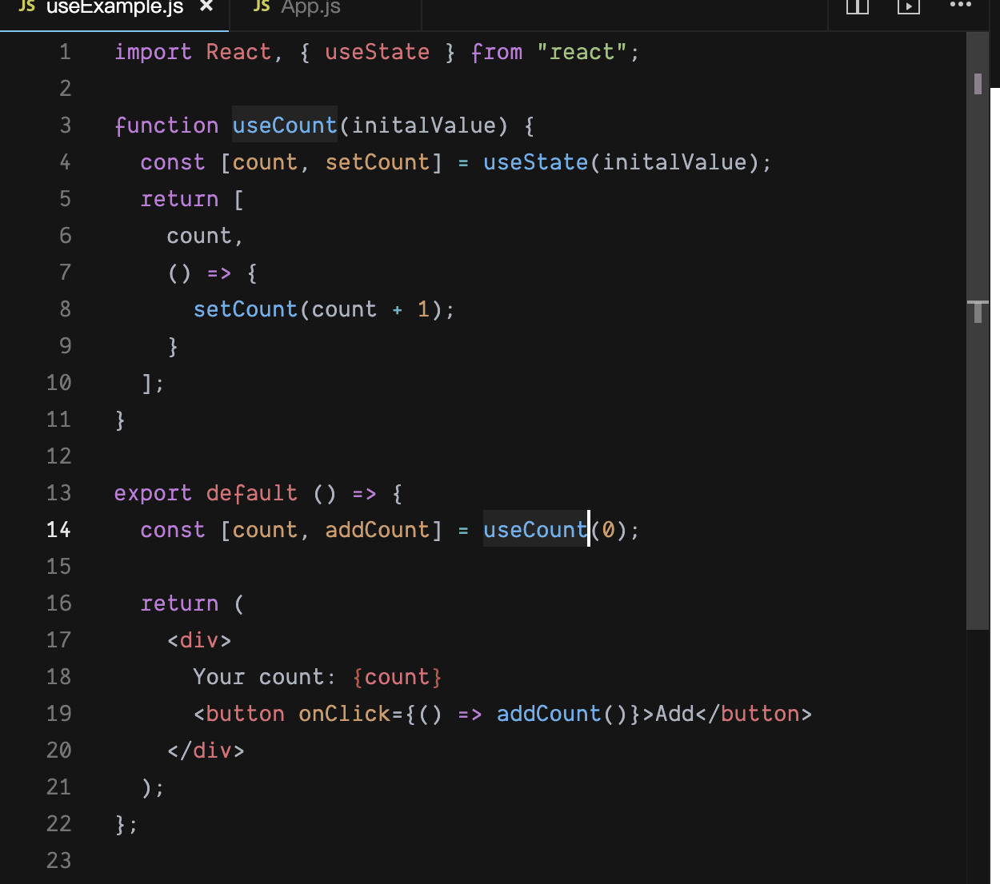
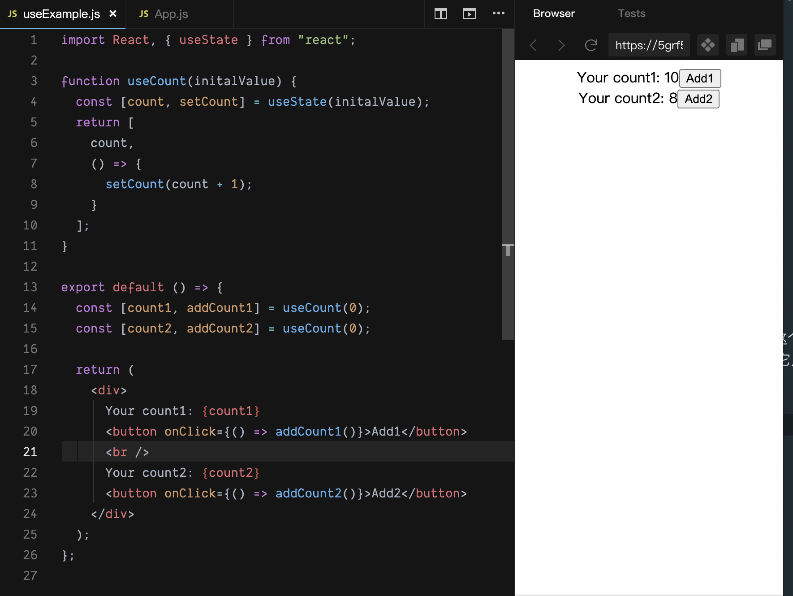
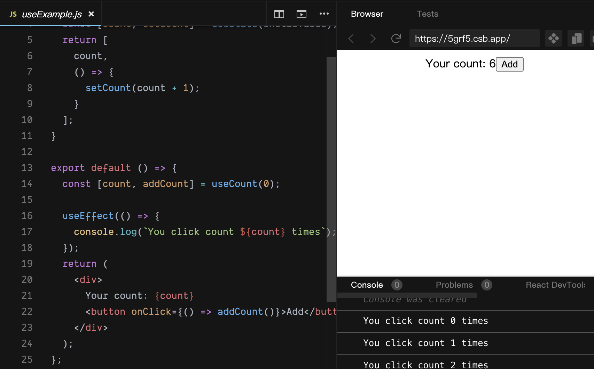
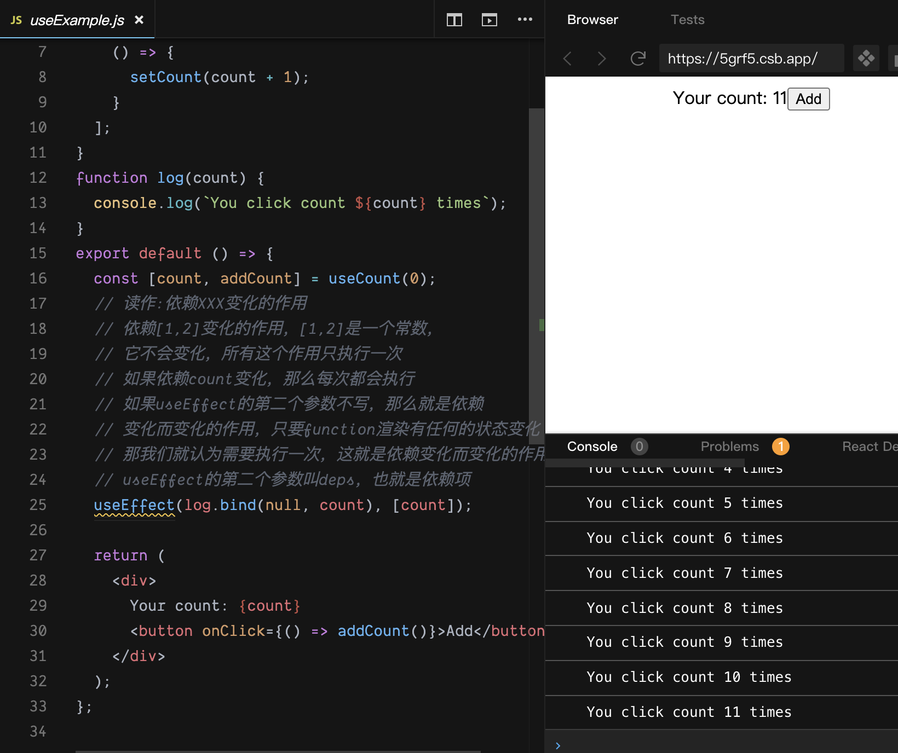
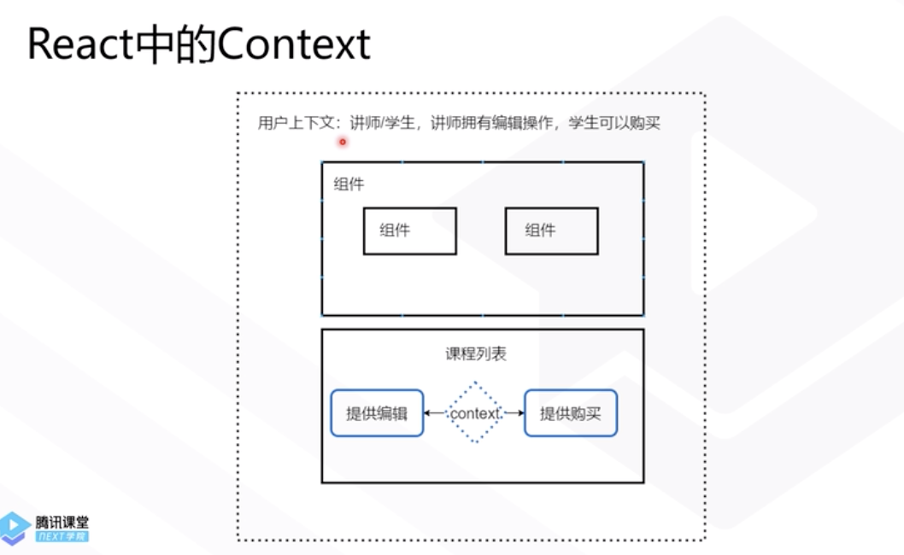

# react-hooks 学习笔记

<a href="https://www.bilibili.com/video/BV1Ge411W7Ra?from=search&seid=5767788873739901924"> 学习视频地址</a>

- UI = f(data),函数 f 将数据(data)**映射**到**用户界面**(UI)

### 状态是数据吗？

### 状态(state)是什么?

- 状态有一个隐含的意思，就是存在**改变状态的行为**(behavior)
- 背后有一个状态机，这个状态机就是改变状态的行为，让状态发生变化
- 例如:点赞数(likes-状态)**隐含**了增加一个赞(addLike-行为)，而这个
  行为(点赞)只有在某种上下文(context)中才会存在
- 什么是上下文？聊历史人物，上下五千年文化就是上下文
- 我们需要，重新再思考 UI 是什么？......

### 什么是 React Hooks

- React 16.8 的新增特性，可以让你在不写 class 的情况下使用 state 等 react 特性
- hooks 是对函数式组件的极大加强

### 如何描述 UI(User Interface)

数据->视图->消息->重算->数据...
数据->视图->行为...->数据...

这个行为有同步和异步的行为

对 数据 拆分:不变的是属性，变化的是状态

状态映射了行为，因此行为可以封装在状态内...

Promise 仅仅是一种决定异步任务状态确定时会出现什么结果的技术，
描述的是一个即将发生的未知的状态的结果
Promise 对象用于延迟和异步计算
状态也可以代表一个未来的状态
stream 流代表的是未来的所有值的集合，背后有时间的关系
视图只需要去感知状态，不需要去感知行为，状态完全可以包含它的行为

- 作用是一个状态和视图之外的，需要一个上下文，就是这个 UI
- 状态与视图，作用与视图，上下文与视图，它们都是**关联的关系，我们称之为 hooks**
  

### 什么是 Hooks？

- 重新定义 UI 界面是什么，有哪些要素:
- state hook(状态的 hook，状态的行为)
- effect hook(作用的 hook，作用的行为)
- context hook(上下文的 hook，上下文的行为)
- 函数 V = f(props,state), UI = V usehook1(), userhook2()......
- 我们可以把 UI 定义为一个使用了 hook1,hook2,hook3...的视图 V
- 点赞的视图，使用了点赞的 hook，点赞的视图只是根据点赞数量 把视图画出来，
  而点赞的 hook 提供了点赞的能力，提供了点赞的状态，这就是我们说的 UI,这就是 React Hook 重新定义的 UI

- 三个基础的 hook:状态、作用和上下文

### 状态

- 在某个上下文中(用户界面)数据和改变数据的行为

```javascript
// 计数器例子，下面是在定义一个hook
const [count, setCount] = useState(0)
// count-状态，setCount-行为，useState-hooks API
// React hooks帮助大家将数据和行为绑定
```

- UI 不需要理解它自己到底触发什么行为,UI 只去思考怎么绘制和触发这个行为，UI 并不理解这个行为要 addCount add 多少，对于 UI 来说，它只是一个渲染函数
  
- 

- 上面中数据和行为是  强关联，而数据、行为和 UI 的关系是软关联,所以我们以后封装形形色色的逻辑，我们就可以与 UI 完全解耦,这种解耦就可以让我们很轻松的进行复用
- 状态背后一定是有它隐式的行为，状态一定要与背后隐式的行为封装在一起

### 作用(Effect)

- UI 如果这样实现，它不仅仅是一个将数据映射到视图的函数
- 客观世界存在输入和输出之外(改变 URL、改变环境......)

```javascript
UI = data ->{
  console.log('xxx')
  return <div></div>
}
```

- 作用就是 UI 将视图映射之外的东西，比如上面的 console.log，连
  数据都没有体现在界面上,它完全不可感知,比如你点了一个 button,它
  启动了一个起重机，或者说它引爆了炸弹
- 函数是一个输入到输出的映射，在这个输入到输出之外的东西我们称之为作用
- 我们认可的作用，比如吃药会病情变好,还有不认可的作用，比如吃药把你吃坏了，就是**副作用**，总之这些都叫作用
- 作用在前端不可避免，比如 console.log 就是一个作用，window.location.href 这是一个作用，setCookie 也是一个作用,因为这些与视图没有产生关联
- 封装作用在 react hooks 里面也是有一套它自己的方法的
  
- 我们描述了一个作用，这个  作用里面在控制台 console 了日志，
   这个作用其实是当状态有变化的时候，它在帮我们输出日志
- Effect 是依据什么变化的作用

  ```js
  function useCount(initalValue) {
  	const [count, setCount] = useState(initalValue)
  	return [
  		count,
  		() => {
  			setCount(count + 1)
  		},
  	]
  }
  function log(count) {
  	console.log(`You click count ${count} times`)
  }
  export default () => {
  	const [count, addCount] = useCount(0)
  	// 读作:依赖XXX变化的作用
  	// 依赖[1,2]变化的作用，[1,2]是一个常数，
  	// 它不会变化，所有这个作用只执行一次
  	// 如果依赖count变化，那么每次都会执行
  	// 如果useEffect的第二个参数不写，那么就是依赖
  	// 变化而变化的作用，只要function渲染有任何的状态变化
  	// 那我们就认为需要执行一次，这就是依赖变化而变化的作用
  	// useEffect的第二个参数叫deps，也就是依赖项
  	useEffect(log.bind(null, count), [count])

  	return (
  		<div>
  			Your count: {count}
  			<button onClick={() => addCount()}>Add</button>
  		</div>
  	)
  }
  ```

  

  - 作用是会发生，但是它依赖什么发生，如果我们填空，那么依赖空变化，
    但是空不会变化，所以作用只执行一次
    ```js
    const [count, addCount] = useCount(0)
    useEffect(() => {
    	console.log(`You click count ${count} times`)
    }, [count])
    ```
    - 当 effect 依赖 count 状态的时候,那么每次 count 变化，useEffect 就会创建它的第一个函数参数，所以每次执行到新函数的时候，重新再 bind 当前函数作用域的 count 值的新的闭包，所以就是作用不要依赖 count 值，如果 effect 想要依赖 count 这个值，就是需要在 deps 也要  依赖 count 这个值
    ```js
    useEffect(() => {
    	if (count > 5) {
    		window.location.href = 'www.imooc.com'
    	}
    }, [count])
    ```
    - 我们还可以描述其它的作用

### React Hooks 如何描述作用(Effect)

- 客观世界有 url 跳转、计时器、logger......我们做不到完美而纯净(pure functional 纯函数)的视图渲染。
- 相同(或类似)的作用如何进行复用,React 团队提出了这个方案。

```js
useEffect(someEffect)
function someEffect(){
  console.log(...)
}
```

```js
function useInterval(callback, time) {
	// 这里的作用只执行一次就行，所以它的依赖为空
	useEffect(() => {
		const I = setInterval(callback, time)
		return () => {
			clearInterval(I)
		}
	}, [])
}
export default () => {
	const [count, setCount] = useState(0)
	useInterval(() => {
		console.log(count, 'hello')
		// 当我们在setCount的参数设置成函数的形式，
		// React会帮助我们取最新的count值
		setCount(count => count + 1)
	}, 1000)
	return (
		<div>
			Your count: {count}
			<button onClick={() => setCount(count + 1)}>Add</button>
		</div>
	)
}
```

### 上下文(Context)

- 木牛木马是什么？
- 他是一个喜欢给大家讲知识的程序员,混迹 B 站和知乎
- 还是?三国时候的木牛木马？据说是可以不用人力就可以跑的永动机
- 上下文就是你理解事物需要的背景知识
  
- 比如上面的组件可以根据用户上下文去处理不同的逻辑
- 在系统里面会有支付上下文,用户上下文等
- 有了上下文，那一个组件的行为和它依赖的数据其实就做了**解耦**
- 在这个情况下，组件更像人一样在工作，是 UI 在自己识别它应该怎么做什么

### React Hooks 解决方案

- UI 产生的过程中，能够从 context 中获取信息(知识)
- UI 更像 一个人而不是机械的结构

```js
UI =>(data)=>{
  const {userType} = useContext(UseTypeContext)
  switch(userType){
    ...不同的渲染逻辑
  }
}
```

- 组件需要依赖上下文
- 在一个系统里，主题是什么，用户是什么，它们都是上下文，就是所有的东西都要去理解的，就是上下文

  ```js
  const themes = {
  	light: {
  		foreground: '#000000',
  		background: '#eeeeee',
  	},
  	dark: {
  		foreground: '#ffffff',
  		background: '#222222',
  	},
  }
  // 创建一个Context
  const ThemeContext = React.createContext({
  	theme: themes.dark,
  	toggle: () => {},
  })
  console.log(ThemeContext.Consumer)
  export default () => {
  	const [theme, setTheme] = useState(themes.light)
  	console.log(1111, theme)
  	// 通过ThemeContext.Provider下发ThemeContext
  	// 而不需要组件的属性一层层传递
  	return (
  		<ThemeContext.Provider
  			value={{
  				theme,
  				toggle: () => {
  					setTheme(theme => {
  						setTheme(theme === theme.light ? theme.dark : theme.light)
  					})
  				},
  			}}
  		>
  			return <ThemeButton />;
  		</ThemeContext.Provider>
  	)
  }
  const Toolbar = () => {
  	return null
  }
  const ThemeButton = () => {
  	// const context = useContext(ThemeContext);
  	// console.log(context);
  	return (
  		<ThemeContext.Consumer>
  			{({ theme, toggle }) => (
  				<button
  					style={{
  						fontSize: 32,
  						background: theme.background,
  					}}
  					onClick={() => {
  						console.log(theme, 11)
  						toggle()
  					}}
  				>
  					Click me！
  				</button>
  			)}
  		</ThemeContext.Consumer>
  	)
  }
  ```
